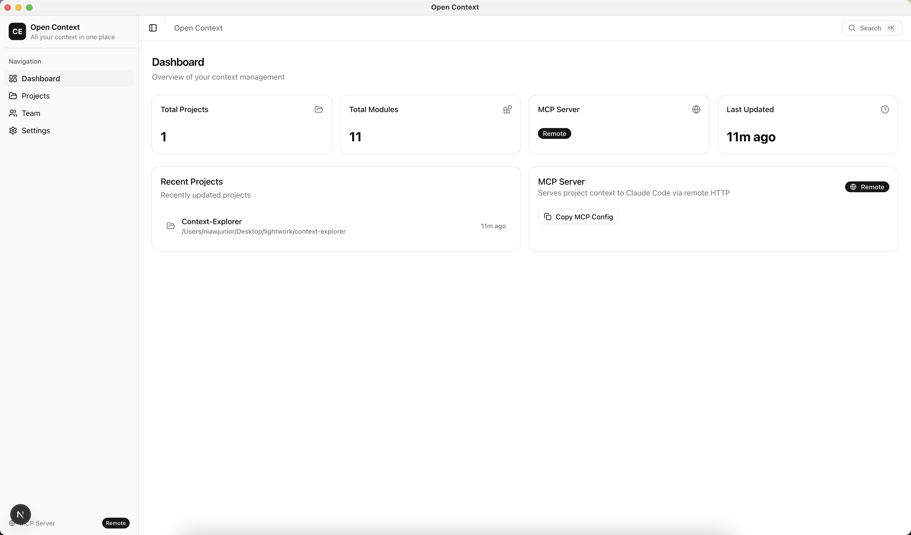
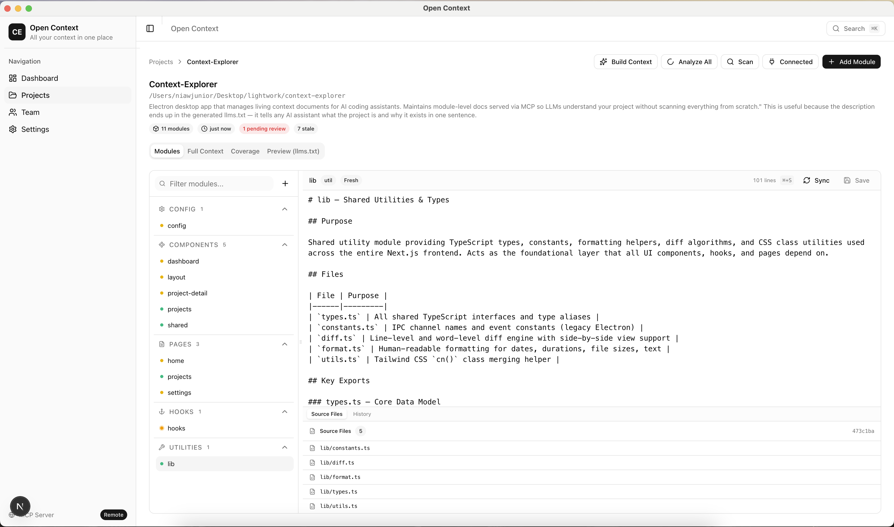
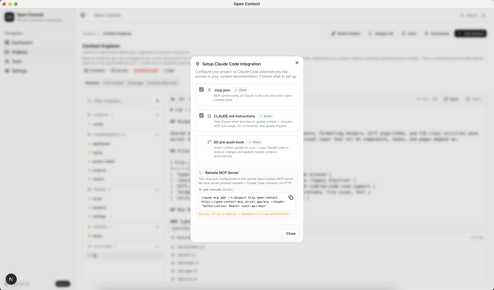
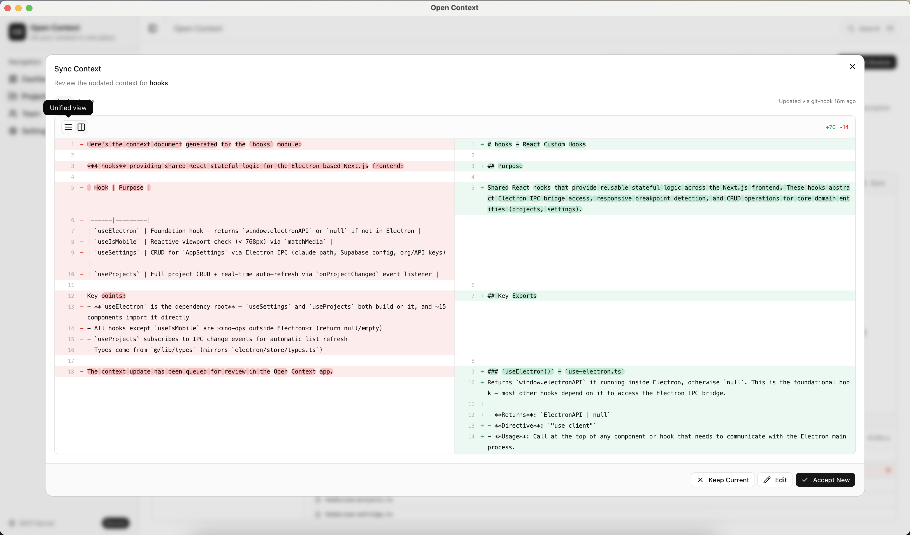
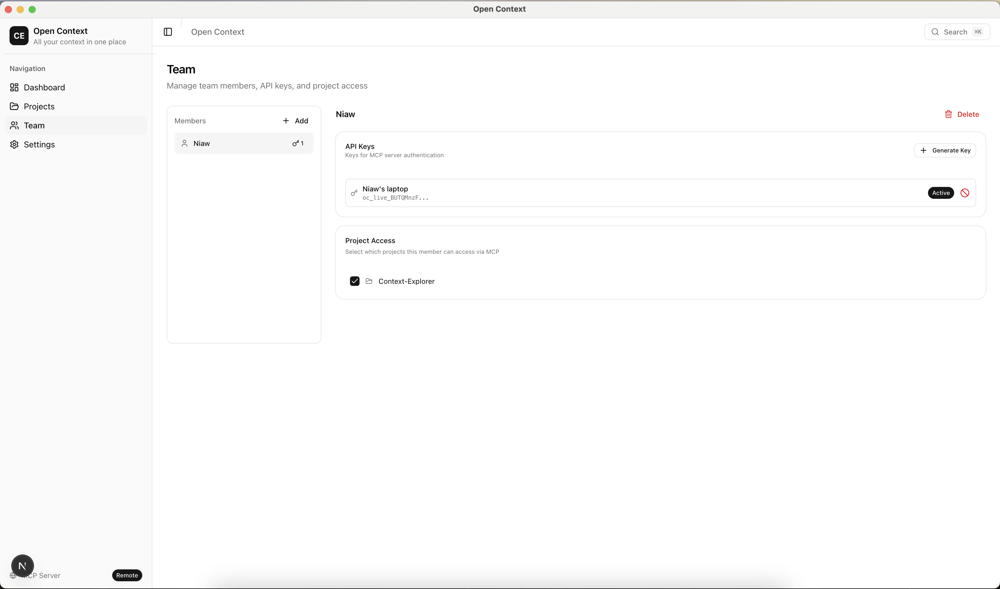
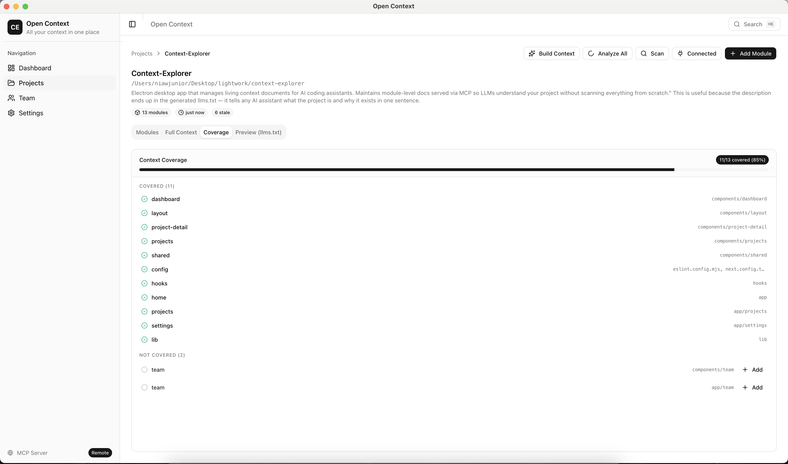
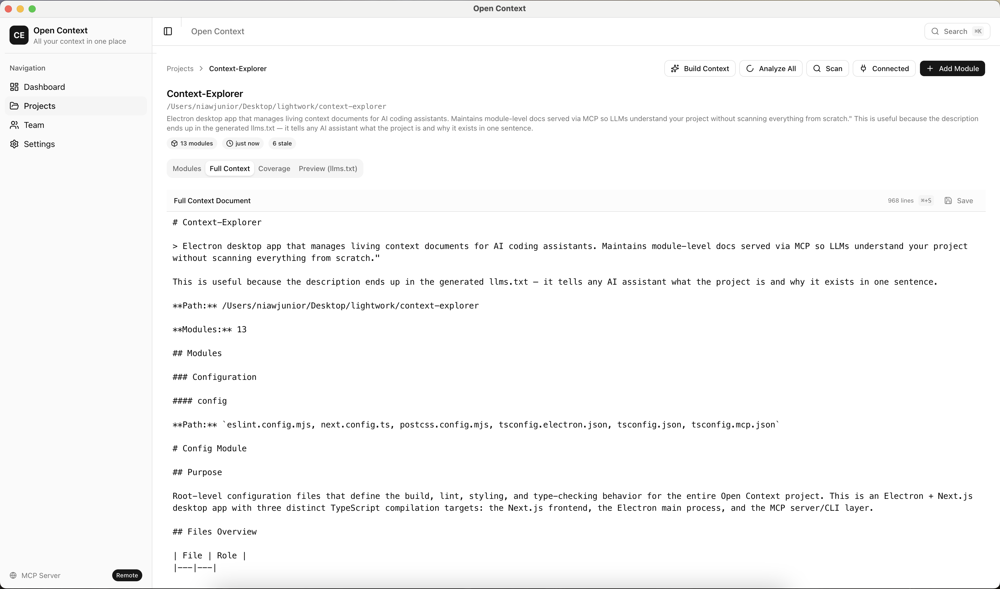

# Open Context

AI context management for codebases — let Claude Code read, search, and update your project documentation via MCP.

Open Context is a desktop app + remote MCP server that maintains structured context documents for your code modules. Developers connect Claude Code to their projects with a single command, and the system keeps documentation in sync through git hooks, AI analysis, and a human-in-the-loop review flow.

## Screenshots

| Dashboard | Project Modules |
|-----------|----------------|
|  |  |

| Setup Claude Code | Context Review (Diff) |
|-------------------|----------------------|
|  |  |

| Team Management | Coverage |
|-----------------|----------|
|  |  |

| Full Context Document |
|----------------------|
|  |

## How It Works

```
Developer pushes code
       ↓
Pre-push hook reads API key from ~/.claude.json
       ↓
Calls REST API (/api/context) to find affected modules
       ↓
Spawns Claude Code in background to analyze diffs
       ↓
Submits updated context via MCP (pending review)
       ↓
Admin reviews + approves in desktop app
       ↓
Claude Code reads fresh context next session
```

### For Developers (No Desktop App Needed)

An admin generates an API key and sends you the setup command:

```bash
claude mcp add --transport http open-context https://open-context-mcp.vercel.app/mcp \
  --header 'Authorization: Bearer oc_live_...'
```

This saves your API key to `~/.claude.json` (local to your machine, never committed).
The project's `.mcp.json` (in git) has only the server URL — no secrets.

Claude Code can now access your project context via 6 MCP tools:

| Tool | Description |
|------|-------------|
| `resolve_project` | Find project by working directory or name |
| `get_project_context` | Get full context document (llms.txt format) |
| `list_modules` | List all modules with coverage status |
| `get_module_context` | Get context for a specific module |
| `search_context` | Search across all project contexts |
| `update_module_context` | Submit updated context (goes through review) |

### For Admins (Desktop App)

The Electron app lets you:

- **Manage projects** — add projects, scan for modules, generate context
- **Setup projects** — writes `.mcp.json` (URL only), `CLAUDE.md`, git hook + `.open-context/` scripts
- **Review AI updates** — approve or reject context changes submitted via MCP
- **Track staleness** — see which modules are outdated based on git commits
- **Manage team** — create members, generate per-developer API keys, control per-project access

## Architecture

```
┌─────────────────────────────────────────────┐
│  Electron Desktop App (Next.js UI)          │
│  • Project & module management              │
│  • Context review & approval                │
│  • Team & API key management                │
├─────────────────────────────────────────────┤
│  Supabase (PostgreSQL)                      │
│  • Projects, modules, context documents     │
│  • Team members, API keys, access control   │
├─────────────────────────────────────────────┤
│  Remote Server (Vercel)                     │
│  • /mcp — 6 MCP tools for Claude Code       │
│  • /api/context — REST API for git hooks    │
│  • API key auth (SHA256 hashed)             │
│  • Member-scoped project filtering          │
└─────────────────────────────────────────────┘
```

### Key Design Decisions

- **Pending context workflow** — AI updates go through human review before becoming active
- **Git-aware staleness** — each module tracks its git snapshot; commits since = staleness
- **Smart git hooks** — pre-push hook calls REST API using dev's API key (no desktop app needed)
- **No secrets in git** — `.mcp.json` has only the server URL; API keys live in each dev's `~/.claude.json`
- **Member-scoped access** — API keys with `member_id` only see assigned projects; admin keys see everything
- **Dual access pattern** — Claude Code uses MCP protocol; git hooks use REST API; both auth via same API keys

## Development Setup

### Prerequisites

- Node.js 20+
- npm
- Supabase project (with migrations applied)
- Claude CLI (for smart context updates)

### 1. Install Dependencies

```bash
npm install
cd remote-server && npm install
```

### 2. Database Setup

Run the migrations in your Supabase SQL editor:

```bash
# In order:
supabase/migrations/001_initial_schema.sql
supabase/migrations/002_team_members.sql
```

### 3. Environment Variables

**Desktop app** — configure in Settings page:
- Supabase URL, Service Role Key, Org ID
- API Key (for MCP auth)

**Remote server** (`remote-server/`) — set in Vercel:
- `SUPABASE_URL`
- `SUPABASE_SERVICE_ROLE_KEY`

### 4. Run the Desktop App

```bash
# Development (Electron + Next.js hot reload)
npm run electron:dev

# Or just the Next.js UI
npm run dev
```

### 5. Deploy the MCP Server

```bash
cd remote-server
vercel --prod
```

### 6. Build for Distribution

```bash
# macOS
npm run electron:build:mac

# Windows
npm run electron:build:win

# Linux
npm run electron:build:linux
```

## Project Structure

```
├── app/                    # Next.js pages (dashboard, projects, team, settings)
├── components/             # React components (shadcn/ui based)
├── electron/
│   ├── main.ts             # Electron main process entry
│   ├── preload.ts          # IPC bridge (context-isolated)
│   ├── ipc/                # IPC handlers (8 categories)
│   ├── store/              # SupabaseStore + SettingsStore
│   └── git/                # GitService + StalenessChecker
├── cli/
│   ├── update-context.ts   # CLI for git hook integration
│   └── smart-context-update.ts  # Background Claude analysis
├── remote-server/
│   ├── api/mcp.ts          # Vercel serverless MCP endpoint
│   ├── api/context.ts      # REST API for git hook (no MCP needed)
│   ├── lib/                # Auth + Supabase data store
│   └── tools/              # 6 MCP tool implementations
├── .open-context/          # Portable hook scripts (committed)
│   ├── update-context.js   # Compiled CLI for pre-push hook
│   └── smart-context-update.js
├── hooks/                  # React hooks (useElectron, useProjects, etc.)
├── lib/                    # Shared types and utilities
└── supabase/migrations/    # Database schema
```

## Contributing

1. Fork the repository
2. Create a feature branch (`git checkout -b feat/my-feature`)
3. Make your changes
4. Run type checks: `npx tsc --noEmit` and `npx tsc --project tsconfig.mcp.json --noEmit`
5. Test the Electron app: `npm run electron:dev`
6. Commit and open a PR

### Build Verification

There are three TypeScript builds to check:

```bash
# Next.js + Electron renderer
npx tsc --noEmit

# CLI + MCP scripts
npx tsc --project tsconfig.mcp.json --noEmit

# Remote server
cd remote-server && npx tsc --noEmit
```

## License

MIT — see [LICENSE](LICENSE) for details.
